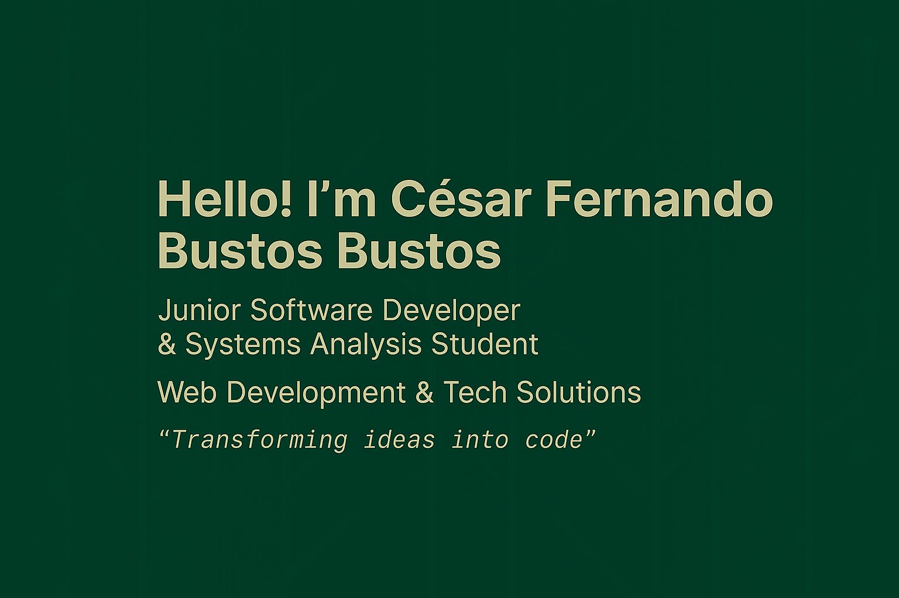

  

# 👋 César Fernando Bustos Bustos

---

## 🇬🇧 English

**.NET Full Stack Developer in Training** | Systems Analysis Student  
Passionate about turning code into real solutions.

### 🧭 About Me
- 🎓 Systems Analysis student, building projects with **C#**, **.NET**, **SQL Server**, **HTML**, **CSS**, **JavaScript**.  
- 🚀 Transitioning into software development, focused on creating a portfolio that reflects growth.  
- ⚙️ Exploring automation tools like **n8n**, **Make**, and **GitHub Actions**.  
- 🎯 Looking for an internship or junior role to learn and contribute from day one.  

### 🧪 Tech Stack
C# · .NET · SQL Server · HTML5 · CSS3 · JavaScript · Git · Visual Studio  

### 🎓 Certifications
- Oracle Cloud Infrastructure 2025 – AI Foundations Associate  
- Web Design with HTML5 + CSS  
- Programming Fundamentals  
- Innovation Tools  
- Network Technician Career Path  

### 🧩 Featured Projects
| Project                  | Tech Stack                          | Link |
|---------------------------|-------------------------------------|------|
| **Client Manager**        | C#, .NET, SQL Server                | [Repo](https://github.com/Marmota-17/client-manager) |
| **Personal Portfolio**    | HTML, CSS, JavaScript               | [Demo](https://marmota-17.netlify.app/) |
| **Automation Bot**        | Python, GitHub Actions, Make/n8n    | [Repo](https://github.com/Marmota-17/automation-bot) |

### 📫 Contact
- ✉️ [cesar_cfbb@hotmail.com](mailto:cesar_cfbb@hotmail.com)  
- 💼 [LinkedIn](https://www.linkedin.com/in/cesarfbustos-dev)  
- 🌐 [Portfolio](https://marmota-17.netlify.app/)  

---

## 🇨🇱 Español

**Desarrollador .NET Full Stack en formación** | Estudiante de Análisis de Sistemas  
Apasionado por transformar código en soluciones reales.

### 🧭 Acerca de mí
- 🎓 Estudiante de Análisis de Sistemas, desarrollando proyectos con **C#**, **.NET**, **SQL Server**, **HTML**, **CSS**, **JavaScript**.  
- 🚀 En transición hacia el desarrollo de software, construyendo un portafolio que refleje mi crecimiento.  
- ⚙️ Explorando herramientas de automatización como **n8n**, **Make** y **GitHub Actions**.  
- 🎯 Buscando práctica profesional o puesto junior para aprender y aportar desde el primer día.  

### 🧪 Stack Tecnológico
C# · .NET · SQL Server · HTML5 · CSS3 · JavaScript · Git · Visual Studio  

### 🎓 Certificaciones
- Oracle Cloud Infrastructure 2025 – AI Foundations Associate  
- Diseño Web con HTML5 + CSS  
- Fundamentos de Programación  
- Herramientas para la Innovación  
- Network Technician Career Path  

### 🧩 Proyectos Destacados
| Proyecto                  | Tecnologías                         | Enlace |
|---------------------------|-------------------------------------|--------|
| **Gestor de Clientes**    | C#, .NET, SQL Server                | [Repositorio](https://github.com/Marmota-17/client-manager) |
| **Portafolio Personal**   | HTML, CSS, JavaScript               | [Demo](https://marmota-17.netlify.app/) |
| **Bot Automatizador**     | Python, GitHub Actions, Make/n8n    | [Repositorio](https://github.com/Marmota-17/automation-bot) |

### 📫 Contacto
- ✉️ [cesar_cfbb@hotmail.com](mailto:cesar_cfbb@hotmail.com)  
- 💼 [LinkedIn](https://www.linkedin.com/in/cesarfbustos-dev)  
- 🌐 [Portafolio](https://marmota-17.netlify.app/)  

---

  
  

